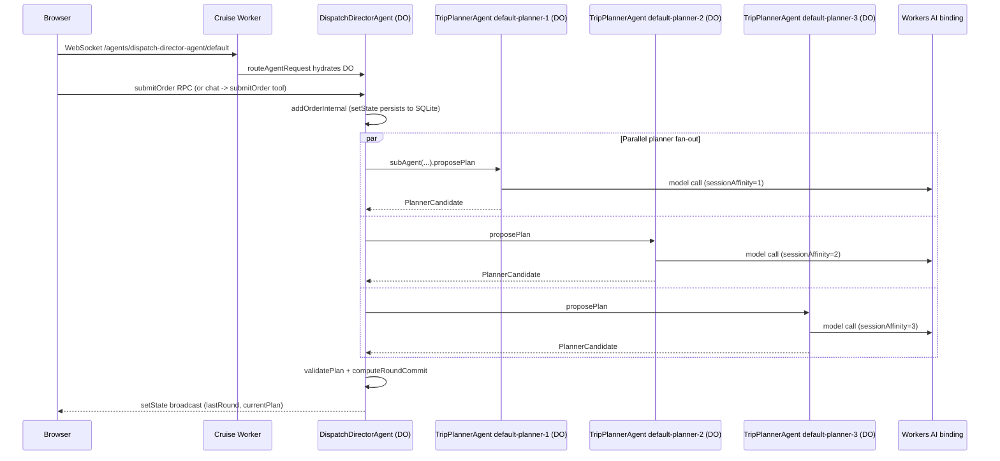

# Cruise on Cloudflare

A summary of how Cruise uses Cloudflare, which resources it binds, and the
lifecycle of those resources at runtime.

## Cloudflare resources in use

The whole app is a single Cloudflare Worker, with several Cloudflare-managed
resources bound to it via [`wrangler.jsonc`](wrangler.jsonc):

- **Worker** (`name: "cruise"`, entry [`src/server/index.ts`](src/server/index.ts))
  — the request handler. Hosts a tiny Hono app for `/api/health` and
  `/api/ai-probe`, and otherwise delegates to `routeAgentRequest` from the
  Cloudflare Agents SDK.
- **Static assets** (`assets` block) — the built React SPA is served from
  Cloudflare's static-asset edge, with
  `not_found_handling: "single-page-application"`.
  `run_worker_first: ["/api/*", "/agents/*"]` ensures Worker code (Hono +
  Agents) handles those paths before the asset server gets a chance.
- **Durable Objects** (two classes, both SQLite-backed via the
  `new_sqlite_classes` migration tags):
  - `DispatchDirectorAgent` — one instance per "system" (named `default` in
    normal use). Owns dispatch state, the chat with the human, and orchestrates
    planner rounds.
  - `TripPlannerAgent` — three instances per system
    (`${systemId}-planner-1..3`) used as parallel sub-agents.
- **Workers AI** (`ai.binding: "AI"`) — used via `workers-ai-provider`'s
  `createWorkersAI({ binding: env.AI })` in
  [`src/agents/cruiseAgentCore.ts`](src/agents/cruiseAgentCore.ts). The
  planner/director model is `@cf/moonshotai/kimi-k2.6`; the cheap diagnostic
  probe uses `@cf/meta/llama-3.1-8b-instruct`. Per-planner divergence is
  achieved by passing different `sessionAffinity` strings into the same binding
  — there's no separate AI Gateway resource.
- **Workers observability** (`observability.enabled: true`) — Cloudflare's
  built-in logs/metrics for the Worker.

There is no KV, R2, D1, Queues, Containers, Cron Triggers, Hyperdrive, or
Vectorize binding. The only persistence is the SQLite storage that ships inside
each Durable Object.

## Are these things "always running"?

No — and importantly, **there is no long-running container or process for the
Director or the Planners**. Cloudflare's Worker + Durable Object model is
request-driven:

- The **Worker** itself is not a server you start. Each incoming HTTP/WebSocket
  request spins up an isolate (or reuses a warm one) on some edge node, runs
  the handler in [`src/server/index.ts`](src/server/index.ts), and is torn down
  when idle. There is no "the Director worker is running."
- A **Durable Object** instance (one Director, three Planners per system) is
  materialized lazily the first time something addresses it by name. While at
  least one client is connected over WebSocket, or while there is in-flight RPC
  work, the DO stays in memory on a single edge location so its in-memory
  state, timers, and `setState` broadcasts are coherent. Once all connections
  close and no work is pending, the runtime hibernates / evicts it. On the next
  request it is rehydrated from its SQLite storage and `initialState`.
- **State persistence** is automatic: every `this.setState(...)` in
  `DispatchDirectorAgent` / `TripPlannerAgent` is written through to the DO's
  SQLite, so eviction is invisible to the client.
- **Workers AI** calls are pure outbound requests from the DO to the AI binding
  for the duration of a planner turn (capped at `PLANNER_TIMEOUT_MS = 300_000`).
  No model is hosted by us.

## Lifecycle of a planner round

Key timing rules already encoded in
[`src/agents/DispatchDirectorAgent.ts`](src/agents/DispatchDirectorAgent.ts):

- Each `proposePlan` is wrapped in a 300 s timeout in `runPlannerWithTimeout`.
- Once any planner returns a valid candidate, `FIRST_VALID_GRACE_MS = 300_000`
  (5 min) caps how long the Director waits for the others. Set equal to the
  planner timeout, so the Director effectively waits for every planner unless
  one hits its hard timeout.
- A monotonic `currentRoundId` is bumped in `askPlannersInternal`; late
  callbacks from superseded rounds are dropped so they can't overwrite newer
  state.
- The browser opens **exactly one** WebSocket — to the Director — per the rule
  in [`AGENTS.md`](AGENTS.md). Planner state reaches the UI via the Director's
  broadcast `lastRound` plus a 1 Hz `getAllPlannerStates` RPC poll, not via
  per-planner WebSockets.

## Local dev vs production

- `npm run dev` runs `vite dev` with `@cloudflare/vite-plugin`, which boots a
  local `workerd` (Miniflare-style) instance that emulates the Worker, Durable
  Objects (with a local SQLite file), and the Workers AI binding (proxied to
  your real Cloudflare account).
- `npm run deploy` ships the same Worker + DO classes + asset bundle to
  Cloudflare via Wrangler. The `migrations` block in
  [`wrangler.jsonc`](wrangler.jsonc) (`v1` adds `TripPlannerAgent`, `v2` adds
  `DispatchDirectorAgent` as `new_sqlite_classes`) tells Cloudflare to provision
  the Durable Object namespaces with SQLite storage on first deploy.

So: there is no perpetually running container. Cloudflare gives us a Worker
that wakes on demand, two Durable Object classes that hold per-system state in
SQLite and live in memory only while needed, and a Workers AI binding that we
call per planner turn.
