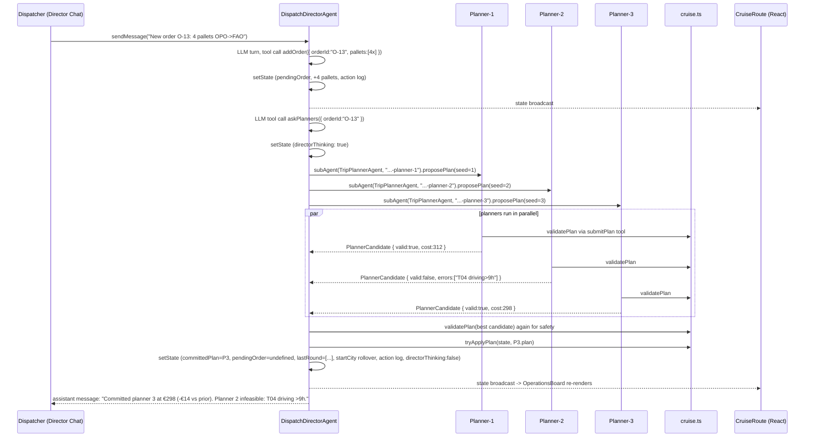

# Cruise — Implementation Plan

Prototype tool that plans tomorrow's shipments for a small refrigerated trucking fleet. A human dispatcher chats with an AI Director; when a new order arrives, the Director spawns three Planner workers in parallel, each re-plans tomorrow's trips to absorb the new order, and the Director validates each plan, discards infeasible ones, and commits the lowest-cost survivor.

Mirrors the stack and "Director Mode" structure of [deloreyj/chess-agent](https://github.com/deloreyj/chess-agent) 1:1, with chess swapped for logistics.

> Scope note: per clarifying instruction, **compressor/temperature tier matching is deferred to a follow-up phase** (v1.x). The data model keeps a nullable `tempRequirement` / `compressorType` hook so it can be turned on without refactoring. All other constraints from the brief (per-leg capacity, 9h driving cap, 30-min service time per stop, 18:00 deadline, 06:00 earliest start, end-of-day position persistence) are in scope for v1.

---

## 1. Reference repo analysis (chess-agent)

The reference lives at [deloreyj/chess-agent](https://github.com/deloreyj/chess-agent). Key patterns Cruise mirrors:

### Tech stack (from [package.json](.chess-agent-ref/package.json))

- Runtime: Cloudflare Workers (`wrangler 4.86`, `compatibility_date: 2026-04-28`, `nodejs_compat`).
- Agents: `agents 0.11.6` + `@cloudflare/think 0.4.1` (Think base class handles chat, tool calls, streaming, state broadcast).
- Storage: Durable Objects with SQLite-backed Think persistence (see migration `v1` in [wrangler.jsonc](.chess-agent-ref/wrangler.jsonc)).
- Model: Workers AI via `workers-ai-provider 3.1.12`, model `@cf/moonshotai/kimi-k2.5` (`chessAgentCore.ts:10`).
- Server: `hono 4.12.15` for `/api/health`; `routeAgentRequest` handles `/agents/*`.
- Client: React 19 + Vite 8 + Cloudflare Vite plugin + `agents/vite` for decorator support ([vite.config.ts](.chess-agent-ref/vite.config.ts)).
- UI kit: `@cloudflare/kumo` (granular imports) + `@cloudflare/ai-chat/react` (`useAgentChat`) + `@phosphor-icons/react`.
- Validation: `zod 4.3.6`.
- Tests: `vitest 4.1.5` (Node runtime, see [vitest.config.ts](.chess-agent-ref/vitest.config.ts)).

### Director Mode spawning and coordination

The reference `SystemDirectorAgent` (`src/agents/SystemDirectorAgent.ts`) shows the shape but only spawns **one** sub-agent sequentially:

- `getPlayer()` uses `this.subAgent(SystemPlayerAgent, playerAgentName)` (`SystemDirectorAgent.ts:195-197`).
- The director calls `player.applyUserMove()` / `player.takeAgentTurnIfNeeded()` as typed RPC stubs (`SystemDirectorAgent.ts:92-101`).
- The director mirrors player state into its own state via `mirrorPlayerState()` (`src/shared/system.ts:69-81`) so the UI can render both with one subscription.
- Action log: `withAction()` + `recordDirectorAction()` (`SystemDirectorAgent.ts:226-240`, `401-404`) push `DirectorAction` entries capped at `MAX_DIRECTOR_ACTIONS = 40`.
- Server-initiated LLM turn hides its synthetic user message by prefixing the id with `INTERNAL_TURN_MESSAGE_ID_PREFIX` (`src/shared/messages.ts:1-5`), filtered client-side in `AgentPanel.tsx:194-196`.

Cruise's new pattern: **three sub-agents in parallel** via the same `subAgent()` primitive, then `await Promise.all(stubs.map((s) => s.proposePlan(...)))`. Not in the reference, but composes cleanly on top of it.

### Control Room UI structure

- Route file: `src/client/routes/SystemRoute.tsx`.
- Two-column layout inside `.game-layout.system-layout`: left panel toggles between `Board` and `SystemControlRoom` via a gear icon (`SystemRoute.tsx:76-106`); right panel is an `AgentPanel` that toggles chat target.
- `SystemControlRoom` renders sections for Persona, Theme, Strategy Memory, Player Trends, and `recentDirectorActions` as a time-stamped `<ol>` (`SystemRoute.tsx:165-234`).

### Director / Player toggle and chat wiring

- Local state: `const [chatTarget, setChatTarget] = useState<ChatTarget>("director")` (`SystemRoute.tsx:23`).
- Conditional `AgentPanel` mount with distinct `key` so each re-mounts with its own `useAgentChat` history (`SystemRoute.tsx:108-133`).
- Hook `useChessSystem` (`src/client/hooks/useChessSystem.ts`) owns one `useAgent` for the director AND a second `useAgent` subscription to the sub-agent using the `sub: [{ agent, name }]` option (`useChessSystem.ts:49-58`). This is the pattern Cruise extends to **three** planner sub-subscriptions.

### Where the chess rules live

- `src/shared/chess.ts` — pure module wrapping `chess.js`: `createInitialGameState`, `createGameView`, `tryApplyMove`, `getLegalMoves`, `createAgentTurnPrompt`. No DO dependencies.
- Invariant from `AGENTS.md:17-23` and `PLAN.md:127-133`: *"The LLM suggests. chess.js decides."* Every tool call validates through `chess.js` before `setState`.
- `AGENTS.md:31`: **"No deterministic fallback move. If the agent cannot produce a valid move after retries, return a clear error."** Cruise inherits this: no fallback plan; Director reports failure to chat.

This module is the direct analogue of the `cruise.ts` rules module in Section 4.

---

## 2. Tech stack & repo layout

Stack is identical to chess-agent (pin the same versions in `package.json`). Only the domain modules, agent classes, route, and hook change.

```txt
cruise/
├── AGENTS.md                       # adapted from chess-agent AGENTS.md
├── PLAN.md                         # this document
├── README.md
├── index.html
├── package.json                    # same deps as chess-agent package.json
├── tsconfig.json
├── vite.config.ts                  # plugins: agents(), react(), cloudflare()
├── vitest.config.ts
├── worker-configuration.d.ts       # generated via `wrangler types`
├── wrangler.jsonc                  # DO bindings + v1 SQLite migration + AI binding
└── src/
    ├── client/
    │   ├── App.tsx                 # routes /, /cruise
    │   ├── main.tsx
    │   ├── styles.css
    │   ├── components/
    │   │   ├── AgentPanel.tsx      # lifted unchanged from chess-agent
    │   │   ├── MessageParts.tsx    # lifted unchanged
    │   │   ├── CityMap.tsx         # NEW: 5-city SVG map + truck/trip overlays
    │   │   ├── OperationsBoard.tsx # NEW: the "board" — cities, trucks, trips
    │   │   ├── DispatchControlRoom.tsx  # NEW: rates, fleet, action log, last round
    │   │   ├── PlannerCandidateCard.tsx # NEW: per-planner summary card
    │   │   └── DispatchControls.tsx     # NEW: systemId input + reset
    │   ├── hooks/
    │   │   └── useDispatchSystem.ts     # NEW: Director + 3 Planner subscriptions
    │   └── routes/
    │       ├── LandingRoute.tsx
    │       ├── CruiseRoute.tsx     # NEW: panelView + chatTarget toggles
    │       └── RouteNav.tsx
    ├── server/
    │   └── index.ts                # re-export DispatchDirectorAgent, TripPlannerAgent
    ├── agents/
    │   ├── cruiseAgentCore.ts      # createCruiseModel(env, seed) factory
    │   ├── DispatchDirectorAgent.ts
    │   └── TripPlannerAgent.ts
    └── shared/
        ├── cruise.ts               # pure rules + cost + seeders + prompt builders
        ├── cruise.test.ts          # Vitest, covers validation + cost + seed
        ├── dispatch.ts             # createInitialDispatchState, helpers (system.ts analogue)
        ├── messages.ts             # INTERNAL_TURN_MESSAGE_ID_PREFIX re-used
        ├── schemas.ts              # Zod for tool inputs and RPC payloads
        └── types.ts                # all domain types
```

`wrangler.jsonc` mirrors [chess-agent's wrangler.jsonc](.chess-agent-ref/wrangler.jsonc):

- `name`: `cruise`.
- `durable_objects.bindings`: `DispatchDirectorAgent`, `TripPlannerAgent`.
- `migrations[].new_sqlite_classes`: same two names under `tag: "v1"`.
- `ai.binding`: `AI`.
- `assets.run_worker_first`: `["/api/*", "/agents/*"]`.
- `assets.not_found_handling`: `"single-page-application"`.

---

## 3. Data model & types

All shapes live in `src/shared/types.ts`; Zod mirrors in `src/shared/schemas.ts`. Compressor/temperature fields are included but left optional so v1 can ignore them; the validator only consults them when `ENABLE_COMPRESSOR_MATCH` is toggled on (see Section 4).

```ts
export type CityId = "LIS" | "OPO" | "COI" | "BRA" | "FAO";
export type CompressorType = "Frozen" | "Chilled" | "Ambient"; // reserved for v1.x

export type Truck = {
  id: string;
  sizeMeters: 13.5;
  capacity: 30;                 // euro pallets
  startCity: CityId;            // anticipated start-of-day location
  compressorType?: CompressorType; // v1.x; unused by validator in v1
};

export type Pallet = {
  id: string;
  orderId: string;
  pickup: CityId;
  dropoff: CityId;
  tempRequirement?: CompressorType; // v1.x
};
```

```ts
export type StopKind = "pickup" | "dropoff";
export type TripStop = {
  city: CityId;
  pickupPalletIds: string[];    // pallets boarded at this stop
  dropoffPalletIds: string[];   // pallets unloaded at this stop
};

export type Trip = {
  id: string;
  truckId: string;
  stops: TripStop[];            // first stop city must equal truck.startCity
  palletIds: string[];          // convenience: union of all stop pickups
};
```

```ts
export type Plan = {
  trips: Trip[];
  unassignedPalletIds: string[]; // must be empty for feasible plan
};

export type PlannerCandidate = {
  plannerName: string;          // e.g. `${systemId}-planner-1`
  seed: number;                 // 1..3
  plan: Plan;
  valid: boolean;
  cost?: number;                // only if valid
  errors?: string[];            // only if invalid
  submittedAt: number;
};
```

```ts
export type OrderEvent = {
  orderId: string;
  createdAt: number;
  pallets: Pallet[];            // already assigned pallet ids
  summary: string;              // one-line for action log / chat
};

export type DirectorAction = {
  id: string;
  at: number;
  label: string;
  detail?: string;
};

export type DispatchState = {
  systemId: string;
  plannerAgentNames: string[];  // 3 stable names
  fleet: Truck[];
  pallets: Pallet[];            // full order book for tomorrow
  committedPlan: Plan;          // current authoritative plan
  pendingOrder?: OrderEvent;    // set between addOrder and commit
  lastRound: PlannerCandidate[]; // last 3 results, kept for UI
  recentDirectorActions: DirectorAction[];
  directorThinking: boolean;
};

export type PlannerState = {
  plannerId: string;            // matches Agent `name`
  lastCandidate?: PlannerCandidate;
  lastPromptAt?: number;
  plannerThinking: boolean;
};
```

### Derived view types (computed, not persisted)

```ts
export type TripTimeline = {
  tripId: string;
  legs: { from: CityId; to: CityId; hours: number }[];
  drivingHours: number;          // sum of leg hours
  serviceHours: number;          // 0.5 × stops.length
  startMinutes: number;          // minutes after midnight, >= 06:00
  endMinutes: number;            // must be <= 18:00
  loadAfterStop: number[];       // pallet count after each stop, each ≤ 30
  endCity: CityId;               // becomes next-day startCity for truckId
};

export type PlanView = Plan & {
  timelines: TripTimeline[];
  totalCost: number;
  totalDrivingHours: number;
  trucksUsed: number;
};
```

---

## 4. `cruise.ts` rules module

Pure functions only. No DO imports. Analogue of [chess.ts](.chess-agent-ref/src/shared/chess.ts). Signatures:

```ts
// --- Geometry & rates ---
travelHours(from: CityId, to: CityId): number;           // lookup in TRAVEL_TIME_MATRIX
ratePerPallet(from: CityId, to: CityId): number;         // € per pallet, v1 ignores compressor
legCost(from: CityId, to: CityId, palletCount: number): number;

// --- Trip simulation ---
simulateTrip(trip: Trip, fleet: Truck[]): TripTimeline;
computeTripCost(trip: Trip, pallets: Pallet[]): number;
computePlanCost(plan: Plan, pallets: Pallet[]): number;

// --- Validation ---
validatePlan(
  plan: Plan,
  fleet: Truck[],
  pallets: Pallet[],
): { ok: true; view: PlanView } | { ok: false; errors: string[] };

// --- Orchestration helpers ---
tryApplyPlan(
  state: DispatchState,
  plan: Plan,
): { ok: true; state: DispatchState } | { ok: false; errors: string[] };

// --- Seed & prompts ---
seedInitialDispatchState(systemId: string): DispatchState;
buildPlannerPrompt(snapshot: DispatchState, newOrder: OrderEvent, seed: number): string;
buildDirectorPrompt(state: DispatchState): string;
```

### Constraint checks implemented by `validatePlan`

Each returns an error string on failure; all errors are collected before returning so the Director can show every reason.

- **Coverage**: every pallet id in `pallets` appears on exactly one trip; `plan.unassignedPalletIds` must be empty. (Brief: "All orders must be fulfilled… no 'defer to next day' option.")
- **Truck uniqueness**: a truck appears in at most one trip per day.
- **Origin**: `trip.stops[0].city === fleet[truckId].startCity`.
- **Stop integrity**: for each pallet, its pickup stop precedes its dropoff stop in the trip; pickup stop city equals `pallet.pickup`; dropoff stop city equals `pallet.dropoff`.
- **Per-leg capacity**: `simulateTrip` produces `loadAfterStop[]`; each entry must be ≤ 30. (Brief: "at no point on a trip may the truck hold more than 30 pallets simultaneously.")
- **Driving-time cap**: `timeline.drivingHours ≤ 9`.
- **Delivery deadline**: `timeline.startMinutes ≥ 360` (06:00) and `timeline.endMinutes ≤ 1080` (18:00). Default `startMinutes = 360`; trips start as early as possible.
- **Service time**: `serviceHours = 0.5 × stops.length`, counted in `endMinutes` but not against the 9h driving cap.
- **Compressor matching (v1.x, behind flag)**: if `ENABLE_COMPRESSOR_MATCH`, every pallet on a trip must share `tempRequirement`, and that value must equal the truck's `compressorType`. Off in v1 so the validator ignores temperature fields.

### `tryApplyPlan` behavior

On success: returns a new `DispatchState` with `committedPlan = plan`, `pendingOrder = undefined`, and each truck's `startCity` updated to `timeline.endCity` **only if the committed plan was executed** — in prototype scope the fleet's `startCity` is rolled forward on commit so the "next-day position" invariant from the brief is visible in the UI. (Open question: should rollover happen on commit or on an explicit "advance day" action? See Section 11.)

### Tests in `cruise.test.ts`

- `validatePlan` accepts the seeded feasible plan.
- Rejects a plan that leaves a pallet unassigned.
- Rejects over-capacity leg (31 pallets mid-trip).
- Rejects trip starting at a city the truck is not at.
- Rejects dropoff before pickup for the same pallet.
- Rejects >9h driving.
- Rejects arrival after 18:00.
- `computePlanCost` matches hand-computed sum for the seeded plan.

---

## 5. Seed data

All seeds live in `cruise.ts` as exported `const` values so tests and the UI can read them without running `seed.ts`. A `scripts/seed.ts` file can regenerate the order book with a different RNG, but is optional.

### 5.1 Cities

Five Portuguese cities: `LIS` Lisboa, `OPO` Porto, `COI` Coimbra, `BRA` Braga, `FAO` Faro.

### 5.2 Travel-time matrix (hours, symmetric, rounded to 0.25h)

Realistic truck travel times by highway. Stored as `TRAVEL_TIME_MATRIX: Record<CityId, Record<CityId, number>>`.

- LIS ↔ OPO: 3.00
- LIS ↔ COI: 2.00
- LIS ↔ BRA: 3.75
- LIS ↔ FAO: 2.75
- OPO ↔ COI: 1.25
- OPO ↔ BRA: 0.75
- OPO ↔ FAO: 5.75
- COI ↔ BRA: 1.75
- COI ↔ FAO: 4.75
- BRA ↔ FAO: 6.50
- Same city: 0.00

Sanity: a round trip OPO→LIS→OPO is 6.00h driving, under the 9h cap. OPO→FAO one-way is 5.75h, so an OPO-start truck can do OPO→FAO→LIS only if total ≤ 9h driving: 5.75 + 2.75 = 8.50h — feasible. OPO→FAO→OPO is 11.5h — infeasible, validator must reject.

### 5.3 Rate card

v1: `€/pallet` depends on route only (compressor multiplier deferred). Proposed formula, encoded as a flat lookup `RATE_PER_PALLET: Record<CityId, Record<CityId, number>>`:

```txt
ratePerPallet(from, to) = round(travelHours(from, to) * 6 + 4)
```

Worked examples:
- LIS→OPO (3.00h): `round(3.00 * 6 + 4) = 22 €/pallet`
- OPO→BRA (0.75h): `round(0.75 * 6 + 4) = 9 €/pallet`
- LIS→FAO (2.75h): `round(2.75 * 6 + 4) = 21 €/pallet` (stored as `20` or `21`, fix at seed time)

v1.x (compressor on): multiply by `{ Ambient: 1.0, Chilled: 1.3, Frozen: 1.7 }`. The multiplier and temperature hooks are in the type already; only the cost function changes.

### 5.4 Initial fleet (10 trucks, 2 per city)

Distribution balanced across cities. Compressor types are assigned now so v1.x can activate them, but v1 ignores them.

- `T01` LIS, Ambient
- `T02` LIS, Chilled
- `T03` OPO, Ambient
- `T04` OPO, Frozen
- `T05` COI, Chilled
- `T06` COI, Ambient
- `T07` BRA, Ambient
- `T08` BRA, Chilled
- `T09` FAO, Frozen
- `T10` FAO, Ambient

All have `sizeMeters: 13.5`, `capacity: 30`.

### 5.5 Initial order book

**Volume target**: 30 pallets spread across 12 orders, mixing short and long routes so planning is non-trivial but a feasible plan exists using ~5–6 of the 10 trucks. Exact pallet ids and quantities belong in `cruise.ts` as a `const INITIAL_PALLETS: Pallet[]`. Sketch (actual pallet-per-order counts chosen so total = 30):

- `O-1` LIS→OPO ×4
- `O-2` OPO→LIS ×3
- `O-3` LIS→COI ×2
- `O-4` COI→LIS ×2
- `O-5` OPO→BRA ×3
- `O-6` BRA→OPO ×2
- `O-7` LIS→FAO ×3
- `O-8` FAO→LIS ×2
- `O-9` COI→BRA ×2
- `O-10` BRA→COI ×2
- `O-11` OPO→COI ×3
- `O-12` COI→OPO ×2

Tempreq is pre-populated but unused in v1.

### 5.6 Initial feasible plan

`seedInitialDispatchState()` runs a tiny deterministic greedy (city-by-city, largest-order-first, single trip per truck, respecting capacity and the 9h cap) to produce `committedPlan`. The plan is then fed back through `validatePlan` at module init; if validation fails, the module throws so the dev notices at boot rather than at first chat turn. The `cruise.test.ts` suite asserts the seeded plan is valid and caches its cost.

---

## 6. Agents

Two Durable Object classes, both extending `Think<Env, State>` for chat, streaming, tool execution, and state broadcasts. Both use the shared model factory.

### 6.1 Model factory — `src/agents/cruiseAgentCore.ts`

Analogous to [chessAgentCore.ts](.chess-agent-ref/src/agents/chessAgentCore.ts):

```ts
export const CRUISE_MODEL_ID = "@cf/moonshotai/kimi-k2.5";

export function createCruiseModel(env: Env, seed?: string | number) {
  const workersAi = createWorkersAI({ binding: env.AI });
  return workersAi(CRUISE_MODEL_ID, {
    reasoning_effort: "low",
    ...(seed ? { sessionAffinity: String(seed) } : {}),
  });
}
```

The Director passes `this.sessionAffinity`; each Planner passes its numeric `seed` (1..3) so the three requests land on independent model sessions and diverge.

### 6.2 `TripPlannerAgent` — `src/agents/TripPlannerAgent.ts`

`extends Think<Env, PlannerState>`. One instance per planner slot. Stable names are allocated by the Director as `${systemId}-planner-${i}` for i in 1..3.

**@callable RPC (invoked by Director):**

- `proposePlan({ seed, snapshot, newOrder }): Promise<PlannerCandidate>` — resets the planner's prior candidate, stores `snapshot` and `newOrder` on `PlannerState`, runs one Think turn with the prompt from `buildPlannerPrompt`, and returns the candidate produced by the `submitPlan` tool. If no `submitPlan` was called, returns `{ valid: false, errors: ["planner did not submit a plan"] }`.
- `getPlannerState(): PlannerState` — for the UI's sub-subscription.

**Tools the planner's LLM can call:**

- `inspectSnapshot` — read-only; returns a compact JSON of fleet, pallets, current `committedPlan`, rates, travel matrix, and the new order.
- `submitPlan({ plan })` — mutating; validates via `cruise.ts.validatePlan`, stores the resulting `PlannerCandidate` on state. If invalid, returns `{ ok: false, errors }` so the LLM can retry within its `maxSteps` budget. If valid, also computes cost.

**System prompt (built by `buildPlannerPrompt(snapshot, newOrder, seed)`):**

- Role: "You are a fleet planner for tomorrow's refrigerated trucking schedule."
- Rules: all pallets in the order book plus the new order must be delivered tomorrow; per-leg capacity 30; driving time ≤ 9h; all deliveries by 18:00; trips start at each truck's `startCity`.
- Seed text: `"Planner variation seed: ${seed}. Prefer a different solution shape from your peers: e.g. seed 1 minimizes trucks used, seed 2 minimizes total km, seed 3 consolidates long-haul legs."`
- Instructs the model to call `inspectSnapshot` at most once, then `submitPlan` exactly once with a full plan covering every pallet id.

**Turn shape:** Director invokes `proposePlan` via RPC stub. The planner writes an internal `INTERNAL_TURN_MESSAGE_ID_PREFIX` message (same pattern as `SystemPlayerAgent.ts:250-258`) so the planner's chat transcript shows the request but the UI's Planner Chat panel hides it.

### 6.3 `DispatchDirectorAgent` — `src/agents/DispatchDirectorAgent.ts`

`extends Think<Env, DispatchState>`. One instance per `systemId`. Initial state from `seedInitialDispatchState(this.name)`.

**@callable RPC (invoked by the React client):**

- `getDispatch(): DispatchState` — simple read.
- `resetDispatch(): DispatchState` — re-seeds, clears chat, clears planner states.
- `submitOrder(input): DispatchState` — top-level entry point when the dispatcher uses a structured form. Internally calls `addOrder` then `askPlanners` then commits. Broadcasts state after every step.
- `getPlannerState(name): PlannerState` — passthrough for UI fallback.

**Tools (for the Director's own chat turns):**

- `inspectDispatch` — returns the current `DispatchState`.
- `addOrder({ pallets, summary })` — appends pallets to `state.pallets`, sets `pendingOrder`, logs action. Pure state mutation, no planner spawn.
- `askPlanners({ orderId })` — spawns 3 sub-agents in parallel:

```ts
const names = this.state.plannerAgentNames;
const planners = names.map((n) => this.subAgent(TripPlannerAgent, n));
const snapshot = this.state; // captured after addOrder
const newOrder = this.state.pendingOrder!;
const candidates = await Promise.all(
  planners.map((p, i) =>
    p.proposePlan({ seed: i + 1, snapshot, newOrder }),
  ),
);
```

Then: merge candidates into `lastRound`, run `validatePlan` on each (belt-and-braces — the planner already validated), pick the lowest-cost valid candidate, call `tryApplyPlan`. On success, `setState` with the committed plan, roll forward each truck's `startCity`, log a `DirectorAction` describing the winning seed and cost delta, and write an assistant chat message. On full failure, log and write an assistant message with aggregated errors — **no fallback plan**, mirroring `AGENTS.md:31`.

- `commitPlan({ plannerName })` — manual override used from Director chat: "use planner 2's plan".

**System prompt (built by `buildDirectorPrompt(state)`):**

Text similar to `SystemDirectorAgent.ts:249-270`. Key rules:
- "You are the dispatch director. You do not produce plans yourself; you delegate to Planner sub-agents and commit the lowest-cost feasible plan."
- When the dispatcher types something like "New order: 6 pallets Porto → Faro", parse it, call `addOrder`, then `askPlanners`, then report the winner (or failure) in chat.
- "If askPlanners reports that no plan is feasible, explain the failure and ask the dispatcher how to proceed. Do not invent a plan."
- Include current fleet summary, pending orders, and last round's outcome in the prompt.

### 6.4 Parallel-spawn contract

The spawn pattern is the one new pattern beyond chess-agent. Documented in code with a comment block. Key properties:

- `this.subAgent(Class, name)` returns a typed RPC stub (from `agents`), same as `getPlayer()` in `SystemDirectorAgent.ts:195-197`.
- Calling `stub.proposePlan(...)` hits the Durable Object over internal RPC; three distinct DOs (different `name`) run concurrently.
- `Promise.all` races them. A hung planner will block the whole round; we wrap each call in a 20-second `Promise.race` timeout and tag that candidate as `{ valid: false, errors: ["timeout"] }`.
- Planner names are stable per system (`${systemId}-planner-1..3`) so the client's `sub: [{ agent, name }]` subscriptions remain connected across rounds and accumulate history.

### 6.5 State broadcast discipline

Every `DispatchState` mutation on the Director calls `setState` so connected clients re-render. `addOrder`, `askPlanners` (twice: once with `directorThinking: true` at start, once with results at end), and `tryApplyPlan` all emit state. The Planner similarly broadcasts `plannerThinking` on entry to `proposePlan` and its `lastCandidate` on exit, which the client consumes via sub-subscriptions.

### 6.6 Internal-turn message hiding

Cruise reuses `INTERNAL_TURN_MESSAGE_ID_PREFIX` from [messages.ts](.chess-agent-ref/src/shared/messages.ts). The Director uses it when it drives its own LLM turn (for chat-driven order entry); the Planner uses it for every `proposePlan` call.

---

## 7. Control Room UI

Route: `/cruise`. Component tree mirrors [SystemRoute.tsx](.chess-agent-ref/src/client/routes/SystemRoute.tsx).

```txt
CruiseRoute
├── header
│   ├── RouteNav (active="cruise")
│   └── DispatchControls (systemId input, reset button)
├── LayerCard.board-panel
│   ├── board-panel-header
│   │   ├── DispatchStatus (directorThinking? planner round status?)
│   │   └── panel-toggle (gear icon)  -> panelView: "operations" | "control-room"
│   ├── Banner (on error)
│   └── EITHER OperationsBoard(dispatch) OR DispatchControlRoom(dispatch)
└── EITHER AgentPanel(directorAgent) OR AgentPanel(plannerAgents[i])
       with chatTarget toggle in headerAccessory
```

### 7.1 `OperationsBoard`

The "chess board" analogue — the visual primary view.

Subscribes to: `dispatch.fleet`, `dispatch.committedPlan`, `dispatch.pendingOrder`, `dispatch.pallets`.

Renders:
- `CityMap`: absolute-positioned SVG with 5 city nodes (Lisboa, Porto, Coimbra, Braga, Faro) arranged roughly as in Portugal. Nodes sized to show truck badges for trucks whose `startCity` equals that city.
- Trip overlays: for each trip in `committedPlan`, draw an arrowed polyline through its ordered stops. Clicking a trip selects it; a side subpanel shows `TripDetail` (truck id, pallet manifest, timeline from `simulateTrip`, cost).
- Pending-orders pulse: if `pendingOrder` exists, the source city pulses and the order summary appears as a callout.
- Unassigned pallets palette: shown only if `committedPlan.unassignedPalletIds` is non-empty (should always be empty in steady state; shown as a red warning strip if not).

Interaction is read-only; the user cannot drag pallets onto trucks. All mutations go through the chat / order submission path.

### 7.2 `DispatchControlRoom`

Shown when panel toggled to "control-room". Kumo `LayerCard` + `Text` sections:

1. **Fleet summary** — table of 10 trucks with id, startCity, compressor (greyed in v1), capacity used today (0..30).
2. **Rate card** — 5×5 table of `ratePerPallet` with diagonal struck out.
3. **Travel-time matrix** — 5×5 hours table.
4. **Last planner round** — three `PlannerCandidateCard`s side-by-side:
   - Planner name, seed, winner badge if chosen.
   - Cost (or "infeasible" in red).
   - Trip count, trucks used, total driving hours.
   - Error list for infeasible candidates.
   - Diff vs. previous committed plan (trips added/removed/modified — computed client-side).
5. **Runtime Action Log** — scrollable `<ol>` of `recentDirectorActions` (same shape as `SystemRoute.tsx:215-232`), capped at 40.
6. **Fleet start-of-day map preview** — compact list of tomorrow's projected start cities per truck (after commit-time rollover).

### 7.3 `PlannerCandidateCard`

Stateless component; props: `candidate: PlannerCandidate`, `committed: Plan`, `isWinner: boolean`. Renders a `LayerCard` with badge, numeric summary, and a collapsible trip list.

### 7.4 State subscription — `useDispatchSystem(systemId)`

Analogue of [useChessSystem.ts](.chess-agent-ref/src/client/hooks/useChessSystem.ts). Shape:

```ts
const director = useAgent<DispatchDirectorAgent, DispatchState>({
  agent: "DispatchDirectorAgent",
  name: systemId,
  onStateUpdate: setDispatch,
});

const plannerAgents = [1, 2, 3].map((i) =>
  useAgent<TripPlannerAgent, PlannerState>({
    agent: "DispatchDirectorAgent",
    name: systemId,
    sub: [{ agent: "TripPlannerAgent", name: `${systemId}-planner-${i}` }],
    onStateUpdate: (next) => setPlanner(i, next),
  }),
);
```

Returns `{ director, plannerAgents, dispatch, planners, submitOrder, resetDispatch, refreshDispatch, error }`.

### 7.5 Kumo imports

Same granular-import discipline as chess-agent: `Button`, `LayerCard`, `Text`, `Banner`, `Textarea` from `@cloudflare/kumo/components/*`. Standalone stylesheet imported in `main.tsx`: `import "@cloudflare/kumo/styles/standalone";`.

---

## 8. Director ↔ Planner toggle and chat

Same two-toggle pattern as chess-agent: a panel-view toggle (gear) and a chat-target toggle.

### 8.1 Panel view toggle

`const [panelView, setPanelView] = useState<"operations" | "control-room">("operations")`. Gear button swaps `OperationsBoard` ↔ `DispatchControlRoom` in the left panel (`CruiseRoute.tsx`). Same shape as `SystemRoute.tsx:76-106`.

### 8.2 Chat-target toggle

Three choices (expanding the chess toggle from 2 to 4, all on one segmented control):

- `director` — chats with `DispatchDirectorAgent`.
- `planner-1` — chats with the seed-1 `TripPlannerAgent`.
- `planner-2`
- `planner-3`

Planner chats are read-mostly: each panel shows the last `proposePlan` turn as a transcript, including the `inspectSnapshot` and `submitPlan` tool calls. The user can still type to a planner for debugging ("why did you split that trip?"), but that is a free-form debug chat, not part of the Director flow.

### 8.3 How chat messages route

- `AgentPanel` is the same component from chess-agent (`AgentPanel.tsx`). The `agent` prop is the agent the panel's `useAgentChat` binds to.
- For `director` target, `agent = director` (the primary `useAgent` result).
- For `planner-N`, `agent = plannerAgents[N-1]` (the sub-subscription result).
- Each panel gets a unique `key` (e.g. `director`, `planner-1-${plannerAgentName}`) so switching targets remounts the chat.

### 8.4 Director-driven chat flow (what makes this "Director Mode")

When the user types `"New order: 6 pallets Porto → Faro"` into Director Chat:

1. `AgentPanel` calls `useAgentChat.sendMessage({ text })` which streams to the Director over its WebSocket.
2. Director receives it as a normal user turn and runs its LLM with the tools described in 6.3.
3. The model calls `addOrder` (parsing pallets/cities from the text), then `askPlanners`.
4. `askPlanners` runs the 3 parallel planners, validates, picks the winner, commits via `tryApplyPlan`, logs actions, and returns `{ winner, committedCost, rejectedPlans }` to the model.
5. The model writes a final assistant message ("Committed planner 2's plan at €312 (−€18 vs prior). Planner 1 was infeasible: driving time >9h on T04.").

### 8.5 Planner-mode fallback

The brief's "Planner mode" toggle (no Director, single agent, no validation gate) is not a separate Durable Object in v1. Instead it is a UI-only mode: `chatTarget = "planner-1"` talks directly to `TripPlannerAgent` and the user can call `submitPlan` conversationally. Validation still runs inside `submitPlan` (we never trust the LLM), but there is no multi-candidate selection. This matches the brief's description: "chat turns directly mutate the plan with no parallelism, no validation gate" — except we keep the validation gate on for safety; see Open Questions.

---

## 9. End-to-end flow walkthrough

Scenario: the committed plan is the seeded one. Dispatcher types into Director Chat:

> "New order O-13: 4 pallets from OPO to FAO, tomorrow."



### Functions and components named at each step

1. `AgentPanel` → `useAgentChat.sendMessage` (client).
2. Director Think harness receives text turn → `DispatchDirectorAgent.getTools()` → `addOrder.execute`.
3. `addOrder` → `this.setState({ ...state, pallets:[...], pendingOrder, recentDirectorActions:[...] })`.
4. Next tool call: `askPlanners.execute` → parallel `subAgent(TripPlannerAgent, name).proposePlan(...)`.
5. Each `TripPlannerAgent.proposePlan` → internal Think turn → LLM calls `inspectSnapshot` then `submitPlan`.
6. `submitPlan.execute` → `cruise.validatePlan` → stores `PlannerCandidate` on `PlannerState` → returns to model → RPC response.
7. Back on the Director, `askPlanners` collects 3 candidates, calls `cruise.validatePlan` again defensively, picks lowest `cost` from valid ones.
8. `cruise.tryApplyPlan(state, winner.plan)` → returns `{ ok:true, state:next }` with updated `committedPlan` and truck `startCity` rollover.
9. `this.setState(next)` broadcasts → client `onStateUpdate` fires in `useDispatchSystem` → `OperationsBoard` re-renders trip overlays → `PlannerCandidateCard`s show the three candidates with the winner badge → `Runtime Action Log` updates.
10. Director's final assistant text is streamed through `useAgentChat` and rendered by `MessageParts` in the Director `AgentPanel`.

### Failure case

If all three candidates are invalid:
- No `tryApplyPlan` call. `committedPlan` is unchanged. `pendingOrder` remains set.
- `setState` still broadcasts `lastRound` (so the UI shows 3 red cards) and adds a `DirectorAction` with the aggregated errors.
- Director writes: "No feasible plan for order O-13. Reasons: Planner 1: driving>9h on T03; Planner 2: capacity breach on T01 leg 2; Planner 3: arrival after 18:00. How do you want to proceed?"
- Per `AGENTS.md:31`, no fallback plan is committed.

---

## 10. Build phases

Ordered, each phase ends in a working checkpoint (`npm run typecheck && npm test && npm run dev` green).

### Phase 1 — Bootstrap + domain rules (no agents, no UI)

Goal: `cruise.ts` is correct and tested.

1. Copy `package.json`, `tsconfig.json`, `vite.config.ts`, `vitest.config.ts`, `wrangler.jsonc`, `index.html`, `worker-configuration.d.ts`, `AGENTS.md` shell from chess-agent. Update names.
2. Add `src/shared/types.ts`, `src/shared/schemas.ts`, `src/shared/cruise.ts` with all signatures from Section 4 and seed data from Section 5.
3. Implement `travelHours`, `ratePerPallet`, `computeTripCost`, `computePlanCost`, `simulateTrip`, `validatePlan`, `tryApplyPlan`, `seedInitialDispatchState`, and a deterministic greedy seeder.
4. Write `src/shared/cruise.test.ts` covering every bullet in Section 4's test list.
5. `npm run typecheck && npm test` green.

### Phase 2 — Planner agent in single-agent mode

Goal: `/cruise` lets the user chat with one planner directly; the Control Room is read-only.

1. Add `src/agents/cruiseAgentCore.ts`.
2. Add `src/agents/TripPlannerAgent.ts` with `PlannerState`, `proposePlan` RPC, `inspectSnapshot` and `submitPlan` tools, prompt from `buildPlannerPrompt`.
3. Add `src/server/index.ts` re-exporting `TripPlannerAgent` only for now.
4. Wire `wrangler.jsonc` DO binding + migration for `TripPlannerAgent`.
5. Add minimal `CruiseRoute.tsx` that connects via `useAgent<TripPlannerAgent>` and renders a single `AgentPanel`.
6. Manual test via `npm run dev`: chat with the planner, ask it to `proposePlan` for the seeded state; confirm validation errors bubble back to the model.

### Phase 3 — Control Room read-only

Goal: visual parity with the brief's Control Room spec, driven by the seeded state.

1. Add `src/shared/dispatch.ts` with `createInitialDispatchState`.
2. Add `OperationsBoard`, `CityMap`, `DispatchControlRoom`, `PlannerCandidateCard`, `DispatchControls` components.
3. Wire `CruiseRoute.tsx` panel toggle (`operations | control-room`).
4. For this phase, the dispatch state source is a second DO — `DispatchDirectorAgent` stub — that only exposes `getDispatch` and `resetDispatch`; planners are not spawned yet. This lets the UI render the seeded plan, fleet, and empty action log.
5. Add `/cruise` to `App.tsx` and a `RouteNav` entry.

### Phase 4 — Director with parallel workers

Goal: end-to-end new-order flow works.

1. Flesh out `DispatchDirectorAgent` with `addOrder`, `askPlanners` (parallel), `commitPlan`, `submitOrder` RPC, `buildDirectorPrompt`.
2. Add 3-planner allocation (`plannerAgentNames`) to `createInitialDispatchState`.
3. Add the action log and `lastRound` updates.
4. Implement truck `startCity` rollover on commit.
5. Update `useDispatchSystem` with 3 sub-subscriptions; render `PlannerCandidateCard`s with live updates.
6. Manual test: submit an order via a debug button (`DispatchControls.submitTestOrder()`); verify the three candidates appear, the winner is chosen, the board updates, the action log records the round. Test the all-infeasible path by inflating a pallet count so 9h cap is breached.

### Phase 5 — Director chat + full toggle UX

Goal: full "Director Mode" UX from the brief.

1. Director's own LLM turn: the `addOrder` tool parses order text; the system prompt teaches it the "New order:" format.
2. Chat target toggle with all 4 targets (`director`, `planner-1..3`); planner panels show the last `proposePlan` transcript.
3. Failure messages in chat when all candidates are invalid.
4. Empty-state hints, "Thinking…" indicators, error banners.
5. Polish: Kumo styling pass; timeline preview inside `TripDetail`.

### Phase 6 — Deployment checkpoint

`npm run build && npm run deploy`. Smoke test the production worker URL. Record any Workers AI latency surprises.

### (Deferred) Phase 7 — Compressor/temperature matching

1. Flip `ENABLE_COMPRESSOR_MATCH` to `true` in `cruise.ts`.
2. Apply compressor multiplier to `ratePerPallet`.
3. Populate `tempRequirement` on all seeded pallets and `compressorType` on all trucks (already in seed).
4. Add "Compressor mismatch" error to `validatePlan`.
5. Update UI: show compressor badge on each truck card; tint trip polylines by tier.
6. Update `buildPlannerPrompt` to mention the tier rules.
7. Extend `cruise.test.ts` with the mismatch cases.

---

## 11. Open questions

Flagged assumptions and decisions that need dispatcher/stakeholder confirmation before implementation begins.

1. **Compressor/temperature v1.x trigger** — confirmed deferred for v1. Is v1.x a fast-follow (before any workshop demo) or genuinely optional?
2. **End-of-day rollover timing** — the brief says "a truck ends the day wherever its last delivery is; that becomes its start location the day after." This plan rolls over on commit, so every committed plan advances tomorrow's start cities immediately. Alternative: keep `startCity` frozen until an explicit "advance day" action. Which matches the workshop story better?
3. **Earliest trip start** — the brief says "assume an 06:00 earliest start." This plan assumes all trucks start exactly at 06:00. Is per-truck staggered start (e.g. driver shift rules) ever relevant?
4. **Service time at start/end** — this plan counts 30 min per pickup OR dropoff stop, nothing at the starting depot. Confirm there is no additional 30 min at `stops[0]` (if the first stop is itself a pickup, one 30 min is counted).
5. **Single trip per truck per day** — implicit from the 12-hour working day and 9h driving cap. Confirm: the validator should not reject a multi-trip plan, but the planner prompt should not encourage it. Or should the validator explicitly enforce "one trip per truck per day"?
6. **Planner-mode validation** — the brief says Planner mode has "no validation gate." This plan keeps the validation gate on inside `submitPlan` for safety (we never trust the LLM to persist a state). Confirm that "no validation gate" means "no multi-candidate rejection loop" and not "accept any garbage plan."
7. **Order parsing grammar** — the Director LLM is asked to parse free-text orders like "New order: 6 pallets Porto → Faro." Do we want a deterministic parser as a tool (`parseOrder`) to guard against LLM miscounts, or is this left to the model?
8. **Planner timeout** — 20 seconds proposed. Acceptable for workshop, or should it be longer?
9. **Seed variation strategy** — the planner prompt tells each seed a different optimization bias (min-trucks, min-km, consolidate-long-haul). Is that acceptable, or should all three get identical prompts and rely purely on model-level seed/temperature variation?
10. **Order book regeneration** — `scripts/seed.ts` generates a randomized order book. Should the seed be configurable from the UI (reset with seed 42 vs 43), or is the deterministic baked-in seed enough?
11. **Map accuracy** — `CityMap` uses a stylized layout of Portugal, not a real map tile. Confirm this is acceptable for the workshop (simpler, zero API keys).
12. **Fleet size fixed at 10** — confirmed in scope. Should the UI expose a debug control to shrink the fleet to 3 for easier infeasibility demos, or is 10 trucks always shown?

---

## Appendix A — `.gitignore` addendum

`/.chess-agent-ref/` is the cloned reference repo. It is kept out of source control:

```txt
.chess-agent-ref/
node_modules/
dist/
.wrangler/
```

